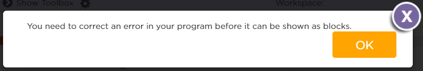
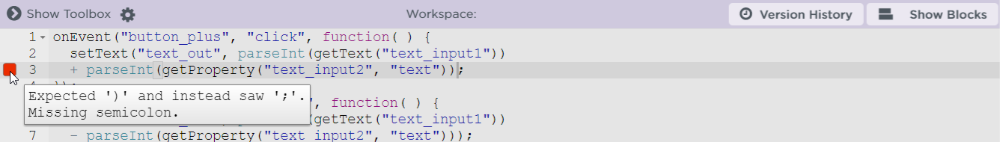

# Frequently Asked Questions (FAQ)
Hier findest du häufig gestellte Fragen.

## Tipps zu Fehlermeldungen.
Ich bekomme die eine Fehlermeldung angezeigt, was muss ich machen?

!> Die Fehlermeldung lesen!

#### Frage: You need to correct an error in your program before it can be shown as blocks.
Wenn ich auf **Show Blocks** klicke, bekomme ich die folgende Fehlermeldung:

#### Antwort
In deinem Programm-Code gibt es einen Fehler (englisch: *error*). Deshalb, kann das Programm nicht in die Blocks zurückgewendelt werden.

i> Häufig handelt es sich um einen Syntax-Fehler. D.h. es fehlt z. B. ein `;` oder eine `)`
Achte auf der linken Seite des Workspaces auf die roten Rechtecke.
Diese roten Rechtecke weisen auf fehler im Programm-Code hin.
Wenn du die Maus über das rote Rechteck bewegst, wir dir ein Fehlertext angezeigt.

## Taschenrechner-App
#### Frage: Wenn ich auf den Plus-Button klicke, passiert nichts.
#### Antwort:
Überprüfe ob der Plus-Button im Design die **genau die gleiche ID** wie in deinem Code.

Im Beispiel: ´button_plus´

w> **Achte** auf Groß- und Kleinschreibung!
Verwende **keine Sonderzeichen** in den IDs (z. B. `+`, `-`, `*`, `/`)

