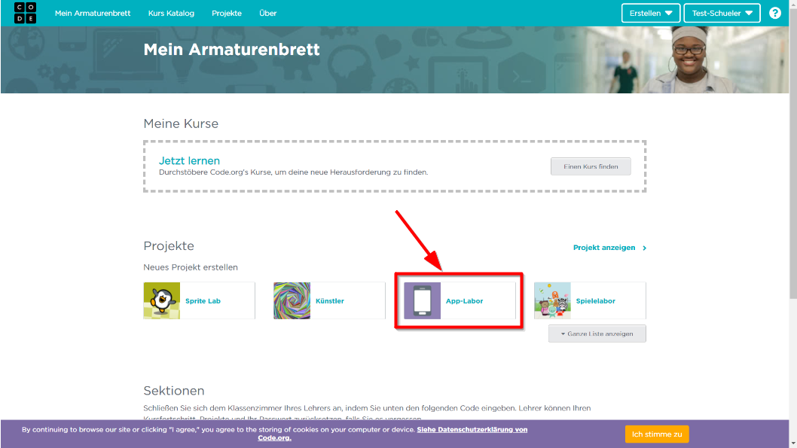

# App Labor Einführung

Hier findest du eine kurze Einführung in die Benutzeroberfläche des **App Labors** von **Code.org**

## Registrierung
Um das App Lab benutzen zu können, musst du dich zunächst bei **Code.org** registieren.

i> Falls du bereits ein Benutzerkonto bei **Code.org** hast, kannst du direkt zum nächsten Abschnitt [Anmeldung](#Anmeldung) gehen.

1. Klicke auf folgenden Link [https://studio.code.org/users/sign_up](https://studio.code.org/users/sign_up) oder gib den Link im Browser ein.
2. Fülle das Anmeldeformular aus und klicke auf **Registieren** oder wähle die Option dich mit einem Google-, Facebook- oder Microsoft-Konto anzumelden.

w> Denke daran dir dein Passwort zu merken.


## Anmeldung
Wenn du ein Benutzerkonto bei **Code.org** hast, kannst du dich [hier](https://studio.code.org/users/sign_in) anmelden.
```
https://studio.code.org/users/sign_in
```

Nach der Anmeldung landest du auf deinem Armaturenbrett.

t> Klicke auf App-Labor, um ein neues Projekt im App Labor zu starten.



## Das App Labor


