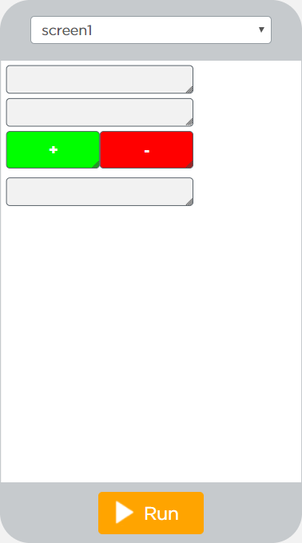
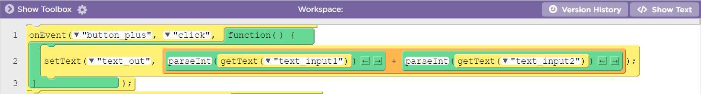

# Die Taschenrechner-App

## Aufgabe 1
t> Erstelle eine Taschenrechner-App, mit der man plus und minus rechnen kann.


### Design
Für das Design der App benötigst du:
1. **2 Textfelder** für die Eingabe der Zahlen, die addiert oder subtrahiert werden sollen.
2. **2 Buttons** für Plus und Minus.
3. **1 Textfeld** für die Ausgabe des Ergebnisses.

Das Design deiner App könnte z. B. so aussehen: 


 
 
### Code
Hier siehst du wie der Code für den `button_plus` aussehen könnte:

i> Die Funktion `parseInt()` wandelt den Text aus dem Textfeld in eine Zahl um, mit der die App rechnen kann.
Die Funktion `parseInt()` findest du **nicht** in der Werkzeugkiste.
Du musst in die Text-Ansicht des Codes wechseln und diese Funktion über die Tastatur hinzufügen.

```
onEvent("button_plus", "click", function( ) {
  setProperty("text_out", "text",
  (parseInt(getProperty("text_input1", "text"))
  +parseInt(getProperty("text_input2", "text"))));
});
```


<!--- TODO Update --->
 
## Aufgabe 2
t> Erweitere deine Taschenrechner-App, sodass man mit ihr auch mal und geteilt rechnen kann.

