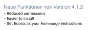
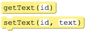
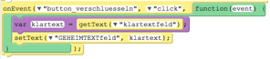

# Die Krypto-App

In den kommenden Wochen ist euer Auftrag, eine App zu programmieren, die es euren Kund*innen ermöglicht, Texte einzugeben und zu verschlüsseln. Dabei sollen sie verschiedene Verfahren nutzen können und sich über diese auch informieren können. Die Gestaltung ist euch freigestellt. 
Die großen Schritte dabei sind die folgenden:

### 1. Kundenbefragung
Ich stehe euch zur Verfügung. Bekommt möglichst genau heraus, was ich mir wünsche und notiert diese Anforderungen.

### 2. Papierprototyp
Entwerft die Screens, die im Laufe der Nutzung der App zu sehen sein werden. Filmt eine „Benutzung der App“. Legt diesen Film im Gruppenordner des Kurses in euren Unterordner.

### 3. Prototyp
Legt einen ersten Prototypen der App an:
ausgewählte Screens, die besonders wichtig sind
sehr reduzierte Bedienelemente, die die nötigste Bedienung der App ermöglichen
erste Funktionalität, die Screens umschaltet


### 4. Agile Weiterentwicklung
Überlegt schrittweise, welche Anteile der App für das Glück der Kund*innen jeweils am wichtigsten sind. Implementiert diese Features. Dokumentiert euren Fortschritt täglich.
Diese Art der Entwicklung kennst du aus Nachrichten im AppStore:

## Entwicklung der Caesar-Verschlüsselung

Entwickelt auch hier zunächst das UI (User Interface): Benötigt werden nun nicht nur Labels, in die Text geschrieben werden kann, sondern auch auch Textfelder, aus denen eingegebener Text ausgelesen werden kann. Im App-Studio heißen sie Text Input. 
Den Text in einem solchen Feld kann man auslesen (get) und setzen (set):

Damit kann man also den Text aus einem Feld auslesen und in ein anderes schreiben, z. B.:

Ein minimaler Prototyp der Verschlüsselungsfunktionalität könnte also sein, dass man einfach den gleichen Text wieder erhält. Das lässt sich dann schrittweise verbessern. Sammelt zunächst, welche Verbesserungen notwendig sind und bringt sie dann in eine Reihenfolge, in der ihr sie abarbeitet.
 
 

